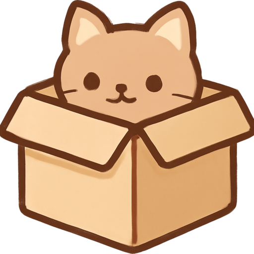

<h1 style="color:red;">点击右上角空白处有Debug菜单！AI智力很低，建议和朋友一起玩</h1>

# 猫的万有引力 (Cat's Universal Gravity)

> 在失重的宇宙里，只有猫咪和引力说了算！

这是一款支持1-4名玩家的本地多人混战游戏。玩家将扮演一只漂浮在宇宙中的猫咪，利用星球间的引力进行跳跃，拾取各种有趣的道具，躲避陨石和其它危险，努力成为最后的幸存者！

## 游戏玩法

- **蓄力跳跃:** 按住`跳跃键`在星球上蓄力，松开后会向鼠标指针方向的反方向跳跃。蓄力时间越长，跳得越高越远。
- **星球行走:** 当猫咪落在星球上时，可以按`左/右键`沿着星球表面行走。
- **生存下去:**
    - 躲避随机出现的**陨石**和致命的**流星雨**。
    - 小心移动的星球，不要被它们**挤压**！
    - 某些道具会产生**黑洞**等危险区域，请务必远离。
    - 将其他玩家撞出安全区或者利用道具淘汰他们。
- **胜利条件:** 成为最后一只幸存的猫咪，赢得该回合的胜利！

## 玩家操作

游戏最多支持4名人类玩家，也可以添加AI玩家进行游戏。

| 玩家   | 向左移动 | 跳跃/蓄力 | 向右移动 |
| ------ | -------- | --------- | -------- |
| **玩家1** | `A`      | `W`       | `D`      |
| **玩家2** | `J`      | `I`       | `L`      |
| **玩家3** | `←`      | `↑`       | `→`      |
| **玩家4** | `Numpad4`| `Numpad8` | `Numpad6`|

## 道具介绍

游戏中有各种道具，可以分为进攻型和功能型两种。

### 进攻道具
| 图标 | 名称 | 描述 |
|:---:|:---:|---|
|  | **猫猫炸弹** | 放置一颗会在5秒后或敌人靠近时爆炸的炸弹，炸飞周围玩家。 |
|  | **猫薄荷** | 获得一次性的强力冲刺跳跃，能将撞到的其他猫咪弹飞。 |

### 功能道具
| 图标 | 名称 | 描述 |
|:---:|:---:|---|
|  | **重力反转** | 【在星球上拾取】立刻反转所在星球的引力5秒，使其变为斥力。 |
|  | **蹲箱子** | 变成一个箱子，持续5秒。期间免疫所有伤害和效果，但无法移动。再次按跳跃键可提前取消。 |
|  | **隐匿** | 进入相位状态4秒，可以穿过其他玩家和陨石，但无法降落在星球上。 |
|  | **护盾** | 【在星球上拾取】为所在星球生成一个可以抵挡5次陨石撞击的护盾。 |
|  | **黑洞** | 【在星球上拾取】3秒后在当前位置生成一个致命的黑洞，持续8秒。 |

## 制作组

- **策划:** Gemini 2.5 Pro, GPT-4o
- **程序:** Gemini 2.5 Pro
- **美术:** Tempietto, GPT-4o
- **音效:** 舔学教授, SunoAI
- **灵感与大力支持:** RenderDog_Studio

---
祝您游戏愉快！ 